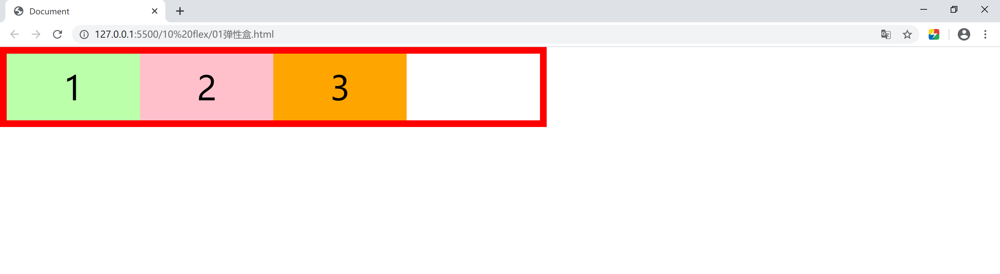

# HTML&CSS笔记

本笔记取自网课[尚硅谷前端基础李立超2019版（含HTML、CSS、 HTML5、CSS3）](https://www.bilibili.com/video/av77217003)

整理：车一晗


[toc]


## 6  Font&Background

### 6.1 字体

字体相关的样式：

+ color：设置字体颜色
+ font-size：字体大小 
  + 和font-size相关的单位：
    + em 相当于当前元素的一个font-size
    + rem 相当于根元素的一个font-size
+ font-family 字体族（字体的格式）
  + 可选值：
    + serif：衬线字体
    + sans-serif：非衬线字体
    + monospace： 等宽字体
    + 指定字体的类别，浏览器会自动使用该类别下的字体
  + font-family 可以同时指定多个字体，多个字体同时使用逗号隔开


```html
<!DOCTYPE html>
<html lang="en">

<head>
    <meta charset="UTF-8">
    <meta name="viewport" content="width=device-width, initial-scale=1.0">
    <meta http-equiv="X-UA-Compatible" content="ie=edge">
    <title>Document</title>
    <style>
        /* font-face可以将服务器中的字体直接提供给用户使用 */
        /* @font-face {
            font-family: ;  指定字体的名字
            src: url();  服务器中字体的路径
        }然后在下面的font-family中使用

        问题：加载速度、版权、字体格式 
        */

        p {
        	color: orange;
        	font-size: 40px;
        	font-family: serif;
        }
    </style>
</head>

<body>
    <p>
        今天天气真不错,hh
    </p>
</body>

</html>
```


代码效果显示：


### 6.2 图标字体（iconfont）

在网页中经常需要使用一些图标，可以通过图片来引入图标，但是图片本身比较大，并且非常不灵活，所以在使用图标时，我们可以将图标直接设置为字体，然后通过font-face的形式来对字体进行引入，这样我们就可以通过使用字体的形式来使用图标


fontawesome 使用步骤：

+ 下载
+ 解压
+ 将css和webfonts移动到项目中
+ 将all.css引入到网页中
+ 直接通过类名来使用图标字体   class="fas fa-bell" class="fab fa-accessible-icon"


```html
<!DOCTYPE html>
<html lang="en">
<head>
    <meta charset="UTF-8">
    <meta name="viewport" content="width=device-width, initial-scale=1.0">
    <meta http-equiv="X-UA-Compatible" content="ie=edge">
    <title>Document</title>
    <link rel="stylesheet" href="./fontawesome/css/all.css">
</head>
<body>
    <!-- <i class="fas fa-bell-slash"></i>
    <i class="fab fa-accessible-icon"></i> -->
    <i class="fas fa-dragon" style="font-size: 160px;color: red;"></i>
</body>
</html>
```


代码效果显示：


### 6.3 图标字体2

通过伪元素设置图标字体

+ 找到要设置图标的元素通过before或after选中
+ 在content中设置字体的编码
+ 设置字体的样式

​           fab

​           font-family:'Font Awesome 5 Brands'


​           fas

​           font-family:'Font Awesome 5 Free'

​           font-weight: 900;

+ 可以通过实体来使用图标字体：&#x图标的编码;


```html
<!DOCTYPE html>
<html lang="en">
<head>
    <meta charset="UTF-8">
    <meta name="viewport" content="width=device-width, initial-scale=1.0">
    <meta http-equiv="X-UA-Compatible" content="ie=edge">
    <title>Document</title>
    <link rel="stylesheet" href="./fontawesome/css/all.css">
    <style>
        li{
            list-style: none;
        }

        li::before{
            /* 
                通过伪元素设置图标字体
                    1.找到要设置图标的元素通过before或after选中
                    2.在content中设置字体的编码
                    3.设置字体的样式
                      fab
                      font-family:'Font Awesome 5 Brands'

                      fas
                      font-family:'Font Awesome 5 Free'
                      font-weight: 900;
            */
            content: '\f1b0';
            font-family: 'Font Awesome 5 Free';
            font-weight: 900;
        }
    </style>
</head>
<body>
    <ul>
        <li>锄禾日当午</li>
        <li>汗滴禾下土</li>
        <li>谁知盘中餐</li>
        <li>粒粒皆辛苦</li>
    </ul>

    <!-- 
        通过实体来使用图标字体：&#x图标的编码;
    -->
    <span class="fas fa-bell"></span>
    <span class="fas">&#xf0f3;</span>

</body>
</html>
```


代码效果显示：


### 6.4 阿里字体库

```html
<!DOCTYPE html>
<html lang="en">
<head>
    <meta charset="UTF-8">
    <meta name="viewport" content="width=device-width, initial-scale=1.0">
    <meta http-equiv="X-UA-Compatible" content="ie=edge">
    <title>Document</title>
    <link rel="stylesheet" href="./iconfont/font_auto/iconfont.css">
    <style>
        i.iconfont{
            font-size: 100px;
        }

        p::before{
            content: '\e6eb';
            font-family: 'iconfont';
            font-size: 30px;
        }
    </style>
</head>
<body>
    <i class="iconfont">&#xe6eb;</i>
    <i class="iconfont icon-auto"></i>

    <p>hello</p>
</body>
</html>
```


代码效果显示：


### 6.5 行高（line height）

+ 文字占有的==实际高度==
+ 可以通过==line-height来设置行高==，也可以直接指定一个大小（px em），还可以直接为行高设置一个整数，即字体的指定的倍数
+ 行高经常用来设置之文字的行间距
  + 行间距 = 行高 - 字体大小


字体宽：字体存在的格子，设置font-size实际上就是在设置字体的宽度


行高会在字体框的上下平均分配


可以==将行高设置为和高度一样的值，使单行文字在一个元素中**垂直居中**==


```html
<!DOCTYPE html>
<html lang="en">
<head>
    <meta charset="UTF-8">
    <meta name="viewport" content="width=device-width, initial-scale=1.0">
    <meta http-equiv="X-UA-Compatible" content="ie=edge">
    <title>Document</title>
    <style>
        div{
            font-size: 50px;

            /* 可以将行高设置为和高度一样的值，使单行文字在一个元素中垂直居中 */
            height: 200px;
            line-height: 200PX;

            /* 
                行高（line height）
                    -文字占有的实际高度
                    -可以通过line-height来设置行高
                     行高可以直接指定一个大小（px em）
                     也可以直接为行高设置一个整数，即字体的指定的倍数
                    -行高经常用来设置之文字的行间距
                     行间距 = 行高 - 字体大小
                字体宽
                    -字体存在的格子，设置font-size实际上就是在设置字体的宽度
                行高会在字体框的上下平均分配
            */

            border: 1px red solid;

            line-height: 100px;
        }
    </style>
</head>
<body>
    <div>哈哈哈  hello</div>
</body>
</html>
```


代码效果显示：


### 6.6 字体的简写属性

font可以设置字体相关的所有属性

+ 语法： font:字体大小(/行高) 字体族
+ 行高可以省略，有一个默认值，行高如果在前面设置过这里会被覆盖

font-weight：字重，字体的加粗 

+ 可选值：normal(默认值) bold(加粗)
+ 100-900 九个级别 （没啥用）

font-style：字体风格

+ 可选值：normal italic(斜体)


```html
<!DOCTYPE html>
<html lang="en">
<head>
    <meta charset="UTF-8">
    <meta name="viewport" content="width=device-width, initial-scale=1.0">
    <meta http-equiv="X-UA-Compatible" content="ie=edge">
    <title>Document</title>
    <style>
        div{
            border: 1px red solid;
            
            /* 
                font可以设置字体相关的所有属性
                    语法：
                        font:字体大小(/行高) 字体族
                         行高可以省略，有一个默认值，行高如果在前面设置过这里会被覆盖
            */

            /* font-size: 50px;
            font-family: 'Times New Roman', Times, serif; */

            /* font: 50px 'Times New Roman', Times, serif; */
            font: 50px/2 微软雅黑 'Times New Roman', Times, serif;

            font-size: 50px;

            /* 
                font-weight 字重 字体的加粗 
                可选值：normal(默认值)  bold(加粗)
                       100-900 九个级别 （没啥用）

                font-style 字体风格
                可选值：normal  italic(斜体)
            */
            
            font-weight: bold;
            font-style: italic;
        }
    </style>
</head>
<body>
    <div>今天天气不错 Hello</div>
</body>
</html>
```


代码效果显示：


### 6.7 文本的样式

text-align：文本的水平对齐

+ 可选值：
  + left：左侧对齐
  + right：右侧对齐
  + center：居中对齐
  + justify：两端对齐

vertical-align：元素的垂直对齐方式

+ 可选值：
  + baseline：默认值 基线对齐
  + top：顶部对齐
  + bottom
  + middle


```html
<!DOCTYPE html>
<html lang="en">

<head>
    <meta charset="UTF-8">
    <meta name="viewport" content="width=device-width, initial-scale=1.0">
    <meta http-equiv="X-UA-Compatible" content="ie=edge">
    <title>Document</title>
    <style>
        div {
            width: 500px;
            border: 1px red solid;

            /* 
                text-align 文本的水平对齐
                可选值：
                    left 左侧对齐
                    right 右侧对齐
                    center 居中对齐
                    justify 两端对齐
            */
            font-size: 20px;
        }

        span {
            font-size: 20px;
            border: 1px blue solid;

            /* 
                 vertical-align  元素的垂直对齐方式
                 可选值：
                    baseline 默认值 基线对齐
                    top 顶部对齐
                    bottom
                    middle
            */
            vertical-align: middle;
        }

        p{
            border: 1px red solid;
        }

        img{
            vertical-align: top;
        }
    </style>
</head>

<body>
    <div>Lorem ipsum dolor sit amet consectetur adipisicing elit. Expedita odio porro officiis ad animi commodi et, hic aut, recusandae qui provident doloremque eum. Deserunt nesciunt optio atque sint eos? Nemo.</div>

    <div>
        今天天气hh<span>真不错hh</span>
    </div>


    <p>
        
    </p>


</body>

</html>
```


代码效果显示：


### 6.8 文本的样式2

text-decoration：设置文本修饰

+ 可选值：
  + none
  + underline
  + line-through：删除线
  + overline：上划线

white-space：设置网页如何处理空白

+ 可选值：
  + normal：正常
  + nowrap：不换行
  + pre：保留空白


```html
<!DOCTYPE html>
<html lang="en">
<head>
    <meta charset="UTF-8">
    <meta name="viewport" content="width=device-width, initial-scale=1.0">
    <meta http-equiv="X-UA-Compatible" content="ie=edge">
    <title>Document</title>
    <style>
        .box1{
            font-size: 50px;

            /* 
                text-decoration 设置文本修饰
                可选值：
                    none
                    underline
                    line-through  删除线
                    overline  上划线
            */

            text-decoration: underline red dotted;
        }

        .box2{
            width: 300px;
            /* 
                white-space 设置网页如何处理空白
                可选值：
                    normal 正常
                    nowrap  不换行
                    pre  保留空白
            */
            white-space: nowrap;
            overflow: hidden;
            text-overflow: ellipsis;
        }
    </style>
</head>
<body>
    <div class="box2">
        Lorem, ipsum dolor sit amet consectetur adipisicing elit. Nihil esse unde dolorum laudantium, totam necessitatibus nulla aperiam perspiciatis amet voluptatem facere quidem. Iusto consectetur minima harum beatae odio minus sapiente!
    </div>

    <div class="box1">
        今天天气不错
    </div>
</body>
</html>
```


代码效果显示：


### 6.9 背景

background-image：设置背景图片

+ 可以同时设置背景图片和背景颜色，这样背景颜色就会成为图片的背景颜色
+ 如果的背景图片小于元素，则背景图片会自动在元素中
+ 如果背景图片大于元素，将会有一部分背景图片无法完全显示

background-repeat：用来设置背景的重复方式

+ 可选值：
  + repeat：默认值，背景会沿着x轴，y轴双方向重复
  + repeat-x：背景会沿着x轴向重复
  + repeat-y：背景会沿着y轴方向重复
  + no-repeat：背景图片不重复

background-position：用来设置图片的背景

+ 设置方式：
  + 通过top left right bottom center 几个表示方位的词来设置背景的位置（九宫格）
  + 两个值，表示水平和垂直方位
  + 写一个值则默认第二个center
+ 通过偏移量来指定背景图片的位置
  + 水平方向和垂直方向的偏移量


```html
<!DOCTYPE html>
<html lang="en">
<head>
    <meta charset="UTF-8">
    <meta name="viewport" content="width=device-width, initial-scale=1.0">
    <meta http-equiv="X-UA-Compatible" content="ie=edge">
    <title>Document</title>
    <style>
        .box1{
            width: 800px;
            height: 800px;
            /* 
                background-color 设置背景颜色
            */
            background-color: #bfa;

            /* 
                background-image  设置背景图片
                    -可以同时设置背景图片和背景颜色，这样背景颜色就会成为图片的背景颜色
                    -如果的背景图片小于元素，则背景图片会自动在元素中
                    -如果背景图片大于元素，将会有一部分背景图片无法完全显示
                    
            */
            background-image: url("../01 introduce/pictures/logo.JPG");

            /* 
                background-repeat  用来设置背景的重复方式
                可选值：
                    repeat 默认值，背景会沿着x轴，y轴双方向重复
                    repeat-x  背景会沿着x轴向重复
                    repeat-y  背景会沿着y轴方向重复
                    no-repeat 背景图片不重复
            */
            background-repeat: no-repeat;

            /* 
                background-position  用来设置图片的背景
                设置方式：
                    通过top left right bottom center 几个表示方位的词来设置背景的位置（九宫格）
                    两个值，表示水平和垂直方位
                    写一个值则默认第二个center

                    通过偏移量来指定背景图片的位置
                        水平方向和垂直方向的偏移量
            */
            /* background-position: center center; */
            background-position: 10px 10px;
        }
    </style>
</head>
<body>
    <div class="box1"></div>
</body>
</html>
```


代码效果显示：


### 6.10 背景2

 background-clip：设置背景的范围

+ 可选值：
  + border-box：默认值，背景会出现在边框的下面
  + padding-box：背景不会出现在边框，只出现在内容区和内边距
  + content-box：背景只会出现在内容区

background-origin：设置背景图片的偏移量计算的原点

+ 可选值：
  + padding-box：默认值，background-position从内边距处开始计算
  + content-box：背景图片的偏移量从内容区处计算
  + border-box：背景图片的偏移量从边框处开始计算

background-size：背景图片的尺寸

+ 参数：宽度 高度
+ 如果只写一个，第二个默认auto，等比例缩放
+ cover：图片比例不变，将元素铺满
+ contain：图片比例不变，将图片在元素中完整显示

background-attachment：背景图片是否跟着元素移动

+ 可选值：
  + scroll：默认值，背景图片会跟着元素移动
  + fixed：背景图片会固定在页面中，不会随着元素移动

==上面都是background背景相关的简写属性，所有背景相关的样式都可以通过该样式来设置，并且该样式没有顺序要求，也没有必须写的==


**注意：**

+ background-size必须写在background-position的后面，并且用/隔开
  + backgrund-size/background-position
+ background-origin要在background-clip的前面


```html
<!DOCTYPE html>
<html lang="en">
<head>
    <meta charset="UTF-8">
    <meta name="viewport" content="width=device-width, initial-scale=1.0">
    <meta http-equiv="X-UA-Compatible" content="ie=edge">
    <title>Document</title>
    <style>
        .box1{
            width: 800px;
            height: 800px;
            background-color: #bfa;
            background-image: url("../01 introduce/pictures/logo.JPG");
            background-repeat: no-repeat;
            border: 10px red solid;
            background-size: 300px 300px;

        }
    </style>
</head>
<body>
    <div class="box1"></div>
</body>
</html>
```


代码效果显示：


### 6.11 线性渐变

通过渐变可以设置一些复杂的背景颜色，可以实现从一个颜色向其他颜色过渡的效果

==**渐变是图片**！！！==

通过background-image来设置


线性渐变：沿着一条直线发生变化

+ linear-gradient(red,yellow) ：红色在开头，黄色在结尾，中间时过渡区域
+ 线性渐变的开头可以指定方向 to left/right/bottom/top
+ 也可以用度数deg表示 xxxdeg 
+ 也可以用圈数turn表示 xxxturn 0.5turn
+ 渐变可以同时指定多个颜色，多个颜色默认下平均分布
+ repeating-linear-gradient()：可以平铺的线性渐变


```html
<!DOCTYPE html>
<html lang="en">
<head>
    <meta charset="UTF-8">
    <meta name="viewport" content="width=device-width, initial-scale=1.0">
    <meta http-equiv="X-UA-Compatible" content="ie=edge">
    <title>Document</title>
    <style>
        .box1{
            width: 200px;
            height: 200px;

            /* background-image: linear-gradient(to right, red 20px,yellow,#bfa,orange); */

            
            /* 
                repeating-linear-gradient()  可以平铺的线性渐变
            */
            background-image: repeating-linear-gradient(red 50px,yellow 100px);
            
        }
    </style>
</head>
<body>
    <div class="box1"></div>
</body>
</html>
```


代码效果显示：


### 6.12 径向渐变

radial-gradient()：径向渐变（放射性效果）

+ 默认情况下，径向渐变的形状是根据元素的形状来计算的
  + 正方形  —>  圆形
  + 长方形  —>  椭圆
+ 我们也可以手动指定径向界面的大小
  + circle
  + ellipse 椭圆
+ 也可以指定渐变的位置
+ 语法：radial-gradient(大小 at 位置，颜色 位置，颜色 位置)
  + 大小：
    + circle：圆形
    + ellipse：椭圆
    + closest-side：近边
    + closest-corner：近角
    + farthest-side：远边
    + farthest-corner：远角
  + 位置：
    + top right left center bottom


```html
<!DOCTYPE html>
<html lang="en">
<head>
    <meta charset="UTF-8">
    <meta name="viewport" content="width=device-width, initial-scale=1.0">
    <meta http-equiv="X-UA-Compatible" content="ie=edge">
    <title>Document</title>
    <style>
        .box1{
            width: 300px;
            height: 300px;
            background-image: radial-gradient(100px 100px at 0 100px,red,yellow);
        }
    </style>
</head>
<body>
    <div class="box1"></div>
</body>
</html>
```


代码效果显示：


## 7 HTML

### 7.1 表格

在现实生活中，经常需要使用表格来表示一些格式化数据，如课程表、名单等。同样在网页中，也需要实现表格，通过==table标签==来创建一个表格


```html
<!DOCTYPE html>
<html lang="en">

<head>
    <meta charset="UTF-8">
    <meta name="viewport" content="width=device-width, initial-scale=1.0">
    <meta http-equiv="X-UA-Compatible" content="ie=edge">
    <title>Document</title>
</head>

<body>
    <!-- 
        在现实生活中，经常需要使用表格来表示一些格式化数据
            课程表、名单
        同样在网页中，也需要实现表格，通过table标签来创建一个表格

    -->

    <table border="1" width=50% align="center">
        <!-- 在table中，使用tr表示表格中的一行，有几个tr就有几行 -->
        <tr>
            <!-- 在tr中用td表示一个单元格，有几个td就有几个单元格 -->
            <td>A1</td>
            <td>B1</td>
            <td>C1</td>
            <td>D1</td>
        </tr>

        <tr>
            <td>A2</td>
            <td>B2</td>
            <td>C2</td>
            <!-- 
                rowspan 纵向合并单元格
            -->
            <td rowspan="2">D2</td>
        </tr>

        <tr>
            <td>A3</td>
            <td>B3</td>
            <td>C3</td>
        </tr>

        <tr>
            <td>A4</td>
            <td>B4</td>
            <!-- 
                colspan 横向合并单元格
            -->
            <td colspan="2">C4</td>
        </tr>
    </table>
</body>

</html>
```


代码效果显示：


### 7.2 长表格

可以将一个表格分成三个部分：

+ 头部 thead
+ 主体 tbody
+ 底部 tfoot

th 表示头部的单元格


```html
<!DOCTYPE html>
<html lang="en">
<head>
    <meta charset="UTF-8">
    <meta name="viewport" content="width=device-width, initial-scale=1.0">
    <meta http-equiv="X-UA-Compatible" content="ie=edge">
    <title>Document</title>
</head>
<body>
    <table border="1" width=50% align="center">
        <!-- 
            可以将一个表格分成三个部分
                头部 thead
                主体 tbody
                底部 tfoot

                th 表示头部的单元格
         -->

        <thead>
            <tr>
                <th>日期</th>
                <th>收入</th>
                <th>支出</th>
                <th>合计</th>
            </tr>
        </thead>

        <tbody>
            <tr>
                <td>2000.1.1</td>
                <td>500</td>
                <td>200</td>
                <td>300</td>
            </tr>
            <tr>
                <td>2000.1.1</td>
                <td>500</td>
                <td>200</td>
                <td>300</td>
            </tr>
            <tr>
                <td>2000.1.1</td>
                <td>500</td>
                <td>200</td>
                <td>300</td>
            </tr>
            <tr>
                <td>2000.1.1</td>
                <td>500</td>
                <td>200</td>
                <td>300</td>
            </tr>
        </tbody>

        <tfoot>
            <tr>
                <td></td>
                <td></td>
                <td>合计</td>
                <td>300</td>
            </tr>
        </tfoot>
    </table>
</body>
</html>
```


代码效果显示：


### 7.3 表格的样式

border-spacing：指定边框之间的距离

border-collapse：设置边框的合并

默认情况下元素在td中是垂直居中的，可以通过vertical-align来修改


如果表格中没有使用tbody而是直接使用tr，那么浏览器会自动创建一个tbody，并且将tr全部放到tbody中。tr不是table的子元素，是后代元素


```html
<!DOCTYPE html>
<html lang="en">
<head>
    <meta charset="UTF-8">
    <meta name="viewport" content="width=device-width, initial-scale=1.0">
    <meta http-equiv="X-UA-Compatible" content="ie=edge">
    <title>Document</title>
    <style>
        table{
            width: 50%;
            border: 1px solid black;
            margin: 0 auto;

            /* border-spacing 指定边框之间的距离 */
            /* border-spacing: 0px; */

            /* border-collapse  设置边框的合并 */
            border-collapse: collapse;
        }

        td{
            border: 1px solid black;
            height: 100px;
            /* 默认情况下元素在td中是垂直居中的，可以通过vertical-align来修改 */
            vertical-align: top;
            text-align: center;
        }

        tr:nth-child(2n){
            background-color: silver;
        }

        /* 
            如果表格中没有使用tbody而是直接使用tr
            那么浏览器会自动创建一个tbody，并且将tr全部放到tbody中
            tr不是table的子元素，是后代元素
         */

         .box1{
             width: 300px;
             height: 300px;
             background-color: orange;

             /* 将元素设置为单元格 */
             display: table-cell;

             text-align: center;
             vertical-align: middle;
         }

         .box2{
             width: 100px;
             height: 100px;
             background-color: yellow;
             margin: 0 auto;

         }
    </style>
</head>
<body>
    <div class="box1">
        <div class="box2"></div>
    </div>


    <table>
        <tr>
            <td>学号</td>
            <td>姓名</td>
            <td>性别</td>
            <td>年龄</td>
            <td>住址</td>
        </tr>
        <tr>
            <td>1</td>
            <td>孙悟空</td>
            <td>男</td>
            <td>18</td>
            <td>花果山</td>
        </tr>
        <tr>
            <td>2</td>
            <td>猪八戒</td>
            <td>男</td>
            <td>28</td>
            <td>高老庄</td>
        </tr>
        <tr>
            <td>4</td>
            <td>沙和尚</td>
            <td>男</td>
            <td>38</td>
            <td>流沙河</td>
        </tr>
        <tr>
            <td>4</td>
            <td>唐僧</td>
            <td>男</td>
            <td>16</td>
            <td>女儿国</td>
        </tr>
    </table>
</body>
</html>
```


代码效果显示：


### 7.4 表单

表单：

+ 在现实生活中用于提交数据
+ 在网页中的表单用于==将本地的数据提交给远程的服务器==
+ 使用form标签来创建表单
+ form的属性：
  + action：表单要提交的服务器的地址
+ 文本框：
  + 注意：数据要提交到服务器中，==必须要为元素指定一个name值==
+ 密码框
+ 单选按钮 
  + 像这种选择框还必须指定value属性，最终作为用户填写的值传递给服务器
  + checked 可以将单选按钮设置为默认选中
+ 多选框
+ 下拉列表：
  + selected 将某个选项设置为默认选中
+ 提交按钮


```html
<!DOCTYPE html>
<html lang="en">

<head>
    <meta charset="UTF-8">
    <meta name="viewport" content="width=device-width, initial-scale=1.0">
    <meta http-equiv="X-UA-Compatible" content="ie=edge">
    <title>Document</title>
</head>

<body>
    <!-- 
        表单：
            -在现实生活中用于提交数据
            -在网页中的表单用于将本地的数据提交给远程的服务器
            -使用form标签来创建表单
     -->

    <!-- 
         form的属性
            action：表单要提交的服务器的地址
      -->
    <form action="target.html">
        <!-- 
              文本框
              注意：数据要提交到服务器中，必须要为元素指定一个name值
        -->
        文本框<input type="text" name="username">
        <br><br>

        <!-- 
            密码框
         -->
         密码框<input type="password" name="password">
         <br><br>

         <!-- 
             单选按钮 
                -像这种选择框还必须指定value属性，最终作为用户填写的值传递给服务器
                -checked 可以将单选按钮设置为默认选中
         -->
         单选按钮<input type="radio" name="hello" value="a">
         <input type="radio" name="hello" value="b">  
         <br><br>

         <!-- 
             多选框
          -->
          多选框<input type="checkbox" name="test" value="1">
          <input type="checkbox" name="test" value="2">
          <input type="checkbox" name="test" value="3">
          <br><br>

          <!-- 
              下拉列表
                selected 将某个选项设置为默认选中
           -->
           <select name="哈哈" id="">
               <option value="i">选项1</option>
               <option selected value="ii">选项2</option>
               <option value="iii">选项3</option>
           </select>
           <br><br>

        <!-- 
          提交按钮
       -->
        <input type="submit" value="注册">
    </form>


</body>

</html>
```

target.html代码（上面代码23行）：

```html
<!DOCTYPE html>
<html lang="en">
<head>
    <meta charset="UTF-8">
    <meta name="viewport" content="width=device-width, initial-scale=1.0">
    <meta http-equiv="X-UA-Compatible" content="ie=edge">
    <title>Document</title>
</head>
<body>
    <h1>您的数据已经收到</h1>
</body>
</html>
```


代码效果显示：


点击注册按钮之后：


### 7.5 表单2

autocomplete="on"：开启自动补全 

readonly：将表单项设置为只读，数据会提交

disabled：将表单项设置为禁用，数据不会提交

autofocus：设置表单项自动获取焦点


```html
<!DOCTYPE html>
<html lang="en">
<head>
    <meta charset="UTF-8">
    <meta name="viewport" content="width=device-width, initial-scale=1.0">
    <meta http-equiv="X-UA-Compatible" content="ie=edge">
    <title>Document</title>
</head>
<body>
    <form action="target.html" autocomplete="off">
        <!-- 
            autocomplete="on" 开启自动补全 
            readonly  将表单项设置为只读，数据会提交
            disabled  将表单项设置为禁用，数据不会提交
            autofocus  设置表单项自动获取焦点
        -->
        <input type="text" name="username" value="hello" readonly>
        <br><br>
        <input type="text" name="a" autofocus>
        <br><br>
        <input type="text" name="b">
        <br><br>

        <!-- <input type="color" name="" id="">
        <br><br>
        <input type="email" name="" id="">
        <br><br> -->

        <input type="submit">
        <!-- 重置按钮 -->
        <input type="reset">

        <!-- 普通的按钮 -->
        <input type="button" value="按钮">
        <br><br>

        <button type="submit">提交</button>
        <button type="reset">重置</button>
        <button type="button">按钮</button>
    </form>
</body>
</html>
```


代码效果实现：


## 8 Animation

### 8.1 过渡

过渡（transition）：

+ 通过过渡可以指定一个属性发生变化时的切换方式
+ 可以创建一些非常好的效果，提升用户体验


transition-property: ;   指定要执行过渡的属性

+ 多个属性用逗号隔开
+ 如果所有的属性都需要过渡，则使用all关键字
+ 大部分属性都支持过渡效果
+ **注意：过渡时必须从一个有效数值向另外一个有效数值进行过渡**


transition-duration: ;  指定过渡效果的持续时间


transition-timing-function: ;  过渡的时序函数

+ 指定过渡的执行方式
+ 可选值：
  + ease：默认值，慢速开始，先加速后减速
  + linear：匀速运动
  + ease-in：加速运动
  + ease-out：减速运动
  + ease-in-out：先加速再减速 和ease差不多，速度不一样
  + cubic-bezier()：来指定时序函数 贝塞尔曲线
  + steps()：分布执行过渡效果，可以设置第二个值：
    + end：在时间结束时执行过渡
    + start：在时间开始时执行过渡


transition-delay: ;   过渡效果的延迟


transition：可以设置过渡相关的所有属性  只有一个要求：如果要写延迟，则两个时间中，第一个是持续时间，第二个是延迟


```html
<!DOCTYPE html>
<html lang="en">
<head>
    <meta charset="UTF-8">
    <meta name="viewport" content="width=device-width, initial-scale=1.0">
    <meta http-equiv="X-UA-Compatible" content="ie=edge">
    <title>Document</title>
    <style>
        *{
            margin: 0;
            padding: 0;
        }

        .box1{
            width: 800px;
            height: 800px;
            background-color: silver;
            overflow: hidden;

        }

        .box1 div{
            width: 100px;
            height: 100px;
            margin-bottom: 100px;
        }

        .box2{
            background-color: #bfa;
            /* transition: all 2s; */

            /* 
                过渡 transition
                    -通过过渡可以指定一个属性发生变化时的切换方式
                    -可以创建一些非常好的效果，提升用户体验
            */

            /* 
                transition-property: ;   指定要执行过渡的属性
                多个属性用逗号隔开
                如果所有的属性都需要过渡，则使用all关键字
                大部分属性都支持过渡效果
                注意：过渡时必须从一个有效数值向另外一个有效数值进行过渡
            */
            transition-property: all;

            /* transition-duration: ;   指定过渡效果的持续时间*/
            transition-duration: 2s;

            /* 
                transition-timing-function: ;   过渡的时序函数
                指定过渡的执行方式
                可选值：
                    ease  默认值 慢速开始，先加速后减速
                    linear 匀速运动
                    ease-in  加速运动
                    ease-out  减速运动
                    ease-in-out  先加速再减速  和ease差不多，速度不一样
                    cubic-bezier() 来指定时序函数  贝塞尔曲线
                    steps()  分布执行过渡效果
                        可以设置第二个值：
                            end  在时间结束时执行过渡
                            start  在时间开始时执行过渡
            */
            transition-timing-function:ease-in ;

            /* 
            transition-delay: ;  过渡效果的延迟
            */
            transition-delay: 2s;


            /* transition  可以设置过渡相关的所有属性   只有一个要求：如果要写延迟，则两个时间中，第一个是持续时间，第二个是延迟 */
        }

        .box3{
            background-color: orange;
            transition-property: all;
            transition-duration: 2s;
        }

        .box1:hover div{
            margin-left:700px;
        }
    </style>
</head>
<body>
    <div class="box1">
        <div class="box2"></div>
        <div class="box3"></div>
    </div>
</body>
</html>
```


### 8.2 动画

动画和过渡类似，都可以实现一些动态的效果，不同的是过渡需要在某个属性发生变化时才会触发，动画可以自动触发动态效果

设置动画效果，必须要先设置一个关键帧，关键帧设置了动画执行的每一个步骤

```
        @keyframes test {

            /* 表示动画的开始位，也可以使用0% */
            to {
                margin-left: 700px;
            }

            /* 表示动画的结束位，也可以使用100% */
            from {
                margin-left: 0;
            }
        }
```


animation-name:  ;   要对当前元素生效的关键字的名字


animation-duration:  ; 动画的执行时间


animation-delay:  ; 动画的延时


animation-timing-function:  ;


animation-iteration-count:  ; 动画执行的次数


animation-direction:  ; 指定动画运行的方向 

+ 可选值：
  + normal：默认值，从from向to运行，每次都是这样
  + reverse 从to向from运行，每次都是这样
  + alternate 从from向to运行，重复执行动画时反向执行
  + alternate-reverse


animation-play-state:  ; 设置动画的执行状态

+ 可选值：
  + running：默认值，动画执行
  + pause：动画暂停


animation-fill-mode:  ; 动画的填充模式 

+ 可选值：
  + none：默认值，动画执行完毕，元素回到原来位置
  + forwards：动画执行完毕，元素停止在结束的位置
  + backwards：动画延时等待时，元素就会处于开始位置
  + both：结合上面两个


```html
<!DOCTYPE html>
<html lang="en">

<head>
    <meta charset="UTF-8">
    <meta name="viewport" content="width=device-width, initial-scale=1.0">
    <meta http-equiv="X-UA-Compatible" content="ie=edge">
    <title>Document</title>
    <style>
        * {
            margin: 0;
            padding: 0;
        }

        .box1 {
            width: 800px;
            height: 800px;
            background-color: silver;
            overflow: hidden;

        }

        .box1 div {
            width: 100px;
            height: 100px;
            margin-bottom: 100px;
            margin-left: 0;
        }

        .box2 {
            background-color: #bfa;

            /* 设置box2的动画 */
            /* animation-name: ;  要对当前元素生效的关键字的名字*/
            animation-name: test;

            /* animation-duration: ;  动画的执行时间 */
            animation-duration: 2s;

            /* animation-delay: ;  动画的延时*/

            /* animation-timing-function: ; */

            /* animation-iteration-count: ;  动画执行的次数 */
            animation-iteration-count: 1;

            /* 
                animation-direction: ;  指定动画运行的方向 
                可选值：
                    normal  默认值 从from向to运行，每次都是这样
                    reverse  从to向from运行，每次都是这样
                    alternate  从from向to运行，重复执行动画时反向执行
                    alternate-reverse
            */
            animation-direction: alternate;

            /* 
                animation-play-state: ;  设置动画的执行状态 
                可选值：
                    running  默认值，动画执行
                    pause  动画暂停
            */
            animation-play-state: running;

            /* 
                animation-fill-mode: ;  动画的填充模式 
                可选值：
                    none  默认值，动画执行完毕，元素回到原来位置
                    forwards  动画执行完毕，元素停止在结束的位置
                    backwards  动画延时等待时，元素就会处于开始位置
                    both  结合上面两个
            */
            animation-fill-mode: none;
        }

        /* 
            动画
                动画和过渡类似，都可以实现一些动态的效果
                不同的是过渡需要在某个属性发生变化时才会触发
                动画可以自动触发动态效果

            设置动画效果，必须要先设置一个关键帧，关键帧设置了动画执行的每一个步骤
        */
        @keyframes test {

            /* 表示动画的开始位，也可以使用0% */
            to {
                margin-left: 700px;
            }

            /* 表示动画的结束位，也可以使用100% */
            from {
                margin-left: 0;
            }
        }
    </style>
</head>

<body>
    <div class="box1">
        <div class="box2"></div>
    </div>
</body>

</html>
```


### 8.3 动画2

创建小球下落的动画

```html
<!DOCTYPE html>
<html lang="en">
<head>
    <meta charset="UTF-8">
    <meta name="viewport" content="width=device-width, initial-scale=1.0">
    <meta http-equiv="X-UA-Compatible" content="ie=edge">
    <title>Document</title>
    <style>
        .outer{
            height: 500px;
            border-bottom: 10px black solid;
            margin: 50px auto;
            overflow: hidden;
        }

        .box1{
            width: 100px;
            height: 100px;
            border-radius: 50%;
            background-color: #bfa;

            animation: ball 1s forwards ease-in ;
        }

        /* 创建小球下落的动画 */
        @keyframes ball {
            from{
                margin-top: 0;
            }

            33%{
                margin-top: 400px;
                animation-timing-function: ease-out;
            }

            66%{
                margin-top: 200px;
            }

            to{
                margin-top: 400px;
            }
        }

    </style>
</head>
<body>
    <div class="outer">
        <div class="box1"></div>
    </div>
</body>
</html>
```


### 8.4 变形

变形就是通过CSS来改变元素的形状或位置，==变形不会影响到页面的布局==

transform用来设置元素的变形效果

+ 平移：
  + translateX()：沿着x轴方向平移
  + translateY()：沿着y轴方向平移
  + translateZ()：沿着z轴方向平移


```html
<!DOCTYPE html>
<html lang="en">
<head>
    <meta charset="UTF-8">
    <meta name="viewport" content="width=device-width, initial-scale=1.0">
    <meta http-equiv="X-UA-Compatible" content="ie=edge">
    <title>Document</title>
    <style>
        body{
            background-color: rgb(236,236,236);
        }
        .box1{
            width: 200px;
            height: 200px;
            background-color: #bfa;
            margin: 0 auto;
            margin-top: 200px;

            /* 
                变形就是通过CSS来改变元素的形状或位置
                    -变形不会影响到页面的布局
                    -transform用来设置元素的变形效果
                        -平移：
                         translateX()  沿着x轴方向平移
                         translateY()  沿着y轴方向平移
                         translateZ()  沿着z轴方向平移
            */
            transform: translateX(100%);
        }

        .box2{
            width: 200px;
            height: 200px;
            background-color: tomato;
            margin: 0 auto;
        }

        .box3{
            /* width: 100px;
            height: 100px; */
            background-color: orange;
            position: absolute;
            /* 这种居中方式，只适用于元素大小确定的情况 */
            /* position: absolute;
            top: 0;
            bottom: 0;
            left: 0;
            right: 0;
            margin: auto; */

            left: 50%;
            transform: translateX(-50%) translateY(-50%); 
        }

        .box4,.box5{
            width: 220px;
            height: 300px;
            background-color: white;
            float: left;
            margin: 0 10px;
            transition: all 0.3s;
        }

        .box4:hover{
            transform: translateY(-4px);
            box-shadow: 0 0 10px rgba(0,0,0,0.3);
        }
    </style>
</head>
<body>
    <div class="box1"></div>
    <div class="box2"></div>
    <div class="box3">aaa</div>

    <div class="box4"></div>

    <div class="box5"></div>
</body>
</html>
```


代码效果显示：


### 8.5 Z轴平移

z轴平移，调整元素在z轴的位置，正常情况就是调整元素和人眼之间的距离

**距离越大，元素离人越近**

z轴平移属于立体效果（近大远小），默认情况下网页不支持透视，必须还要设置网页的视距


```html
<!DOCTYPE html>
<html lang="en">
<head>
    <meta charset="UTF-8">
    <meta name="viewport" content="width=device-width, initial-scale=1.0">
    <meta http-equiv="X-UA-Compatible" content="ie=edge">
    <title>Document</title>
    <style>
        html{
            /* 设置当前网页的视距为800px，人眼距网页的距离 */
            perspective: 800px;
        }
        body{
            border: 1px red solid;
            background-color: rgb(241,241,241);
        }
        .box1{
            width: 200px;
            height: 200px;
            background-color: #bfa;
            margin: 200px auto;

            /* 
                z轴平移，调整元素在z轴的位置，正常情况就是调整元素和人眼之间的距离
                距离越大，元素离人越近

                z轴平移属于立体效果（近大远小），默认情况下网页不支持透视
                必须还要设置网页的视距
            */
            transition: 2s;
        }

        body:hover .box1{
            transform: translateZ(200px);
        }
    </style>
</head>
<body>
    <div class="box1"></div>
</body>
</html>
```


### 8.6 旋转

通过旋转可以使元素沿x，y或z轴旋转指定的角度

+ rotateX()
+ rotateY()
+ rotateZ()


```html
<!DOCTYPE html>
<html lang="en">
<head>
    <meta charset="UTF-8">
    <meta name="viewport" content="width=device-width, initial-scale=1.0">
    <meta http-equiv="X-UA-Compatible" content="ie=edge">
    <title>Document</title>
    <style>
        html{
            /* 设置当前网页的视距为800px，人眼距网页的距离 */
            perspective: 800px;
        }
        body{
            border: 1px red solid;
            background-color: rgb(241,241,241);
        }
        .box1{
            width: 200px;
            height: 200px;
            background-color: #bfa;
            margin: 200px auto;
            transition: 2s;
        }

        body:hover .box1{
            /* 
                通过旋转可以使元素沿x，y或z轴旋转指定的角度
                rotateX()
                rotateY()
                rotateZ()
            */
            transform: rotateY(180deg);
            /* 设置是否显示元素的背面 */
            backface-visibility: hidden;

        }
    </style>
</head>
<body>
    <div class="box1"></div>
</body>
</html>
```


### 8.7 缩放

对元素进行缩放

+ scaleX()
+ scaleY()

transform-origin: ;     变形的原点，默认值center

​    

```html
<!DOCTYPE html>
<html lang="en">
<head>
    <meta charset="UTF-8">
    <meta name="viewport" content="width=device-width, initial-scale=1.0">
    <meta http-equiv="X-UA-Compatible" content="ie=edge">
    <title>Document</title>
    <style>
        .box1{
            width: 100px;
            height: 100px;
            background-color: #bfa;
            transition: 2s;
            margin: 100px auto;

            /* 
                变形的原点  默认值center
            */
            transform-origin: 20px 20px;
        }

        .box1:hover{
            /* 
                对元素进行缩放
                scaleX()
                scaleY()
            */
            transform: scaleX(2) scaleY(2);
        }

        .img-wrapper{
            width: 183px;
            height: 183px;
            border: 1px red solid;
            /* 图片在父元素内缩放 */
            overflow: hidden;
        }

        img{
            transition: 1s;
        }

        .img-wrapper:hover img{
            transform: scale(1.2);
        }
    </style>
</head>
<body>
    <div class="box1"></div>

    <div class="img-wrapper">
        
    </div>
</body>
</html>
```


## 9 Less

### 9.1 Less简介

less是CSS的预处理语言，是CSS的增强版，通过less可以编写更少的代码来实现更强大的样式。在less中，添加了许多新特性，如对变量的支持，对mixin的支持等。less的语法大体上和css语法一致，但增添了许多对css的扩展，所以浏览器**无法直接执行less代码**，因此必须要将less转换成css，然后才能交给浏览器执行。这里可以安装vscode中的Easy Less扩展，可以自动将编写的less文件转换成同名css文件


```less
<!DOCTYPE html>
<html lang="en">
<head>
    <meta charset="UTF-8">
    <meta name="viewport" content="width=device-width, initial-scale=1.0">
    <meta http-equiv="X-UA-Compatible" content="ie=edge">
    <title>Document</title>
    <style>
        html{
            /* css原生支持变量的设置 */
            --color:#bfa;
            --length:100px;
        }
        .box1{
            /* calc() 计算函数 */
            width: calc(1000px/2);  
            height: var(--length);
            background-color: var(--color);
        }
        .box2{
            width: var(--length);
            height: var(--length);
            color: var(--color);
        }
        .box3{
            width: var(--length);
            height: var(--length);
            border: 10px solid var(--color);
        }
    </style>
</head>
<body>
    <!-- 
        less是CSS的预处理语言
            -less是CSS的增强版，通过less可以编写更少的代码来实现更强大的样式
            -在less中，添加了许多新特性，像对变量的支持，对mixin的支持等
            -less的语法大体上和css语法一致，但less中增添了许多对css的扩展，所以浏览器无法直接执行less代码，因此必须要将less转换成
             css，然后才能交给浏览器执行
     -->
     <div class="box1">aaa</div>
     <div class="box2">aaa</div>
     <div class="box3">aaa</div>
</body>
</html>
```


### 9.2 Less的语法

第8行，引入css文件

```html
<!DOCTYPE html>
<html lang="en">
<head>
    <meta charset="UTF-8">
    <meta name="viewport" content="width=device-width, initial-scale=1.0">
    <meta http-equiv="X-UA-Compatible" content="ie=edge">
    <title>Document</title>
    <link rel="stylesheet" href="css/other.css">
</head>
<body>
    <div class="box1"></div>
</body>
</html>
```


other.css是根据我们编写的other.less自动生成的

other.less代码：

```less
//将其他less引入到当前less中
@import "syntax2.less";

.box1{
    //在less中所有数值都可以进行运算
    //加减乘除都可
    width: 101px - 1PX;
    height: 100px * 2;
    background-color: #bfa;
}
```

syntax2.less代码：（包含一些基本的语法）

```less
.box1{
    .box2{
        color: red;
    }
    > .box3{
        color: red;
    }

    //为box1设置hover
    // & 就表示外层的父元素
    &:hover{
        color: orange;
    }
}

.p1{
    width: 100px;
    height: 200px;
}

//extend 扩展，对当前选择器扩展指定选择器的样式（选择器分组）
.p2:extend(.p1){
    color: red;
}

.p3{
    //直接对指定的样式进行引用，就相当于将p1的样式在这里进行了复制
    //mixin  混合
    .p1();
    color: orange;
}

//使用类选择器时可以在选择器后面添加一个括号，这时实际上就创建了一个mixin
.p4(){
    width: 100px;
    height: 100px;
    background-color: #bfa;
}

.p5{
    .p4;
}

//混合函数 可以直接设置变量
.test(@w:50px , @color:blue){  //设置默认值，否则使用时参数不能少
    width: @w;
    height: 100px;
    border: 1px @color solid;
}

div{
    //调用混合函数，按顺序传递参数
    //.test(100px,rgb(255,0,0));
    //按名称传递参数
    .test(@color:red , @w:100px);
}

span{
    //计算中间颜色
    color: average(red,yellow);
}

html{
    width: 100%;
    height: 100%;
}

body{
    width: 100%;
    height: 100%;
    background-color: #bfa;
}

body:hover{
    //将颜色加深10%
    background-color: darken(#bfa,10%);
}
```


自动生成的other.css代码：

```css
.box1 .box2 {
  color: red;
}
.box1 > .box3 {
  color: red;
}
.box1:hover {
  color: orange;
}
.p1,
.p2 {
  width: 100px;
  height: 200px;
}
.p2 {
  color: red;
}
.p3 {
  width: 100px;
  height: 200px;
  color: orange;
}
.p5 {
  width: 100px;
  height: 100px;
  background-color: #bfa;
}
div {
  width: 100px;
  height: 100px;
  border: 1px red solid;
}
span {
  color: #ff8000;
}
html {
  width: 100%;
  height: 100%;
}
body {
  width: 100%;
  height: 100%;
  background-color: #bfa;
}
body:hover {
  background-color: #92ff77;
}
.box1 {
  width: 100px;
  height: 200px;
  background-color: #bfa;
}
/*# sourceMappingURL=./other.css.map */
```


## 10 Flex

### 10.1 弹性盒

flex(弹性盒、伸缩盒)

+ css中的又一种布局手段，主要用来替代浮动来完成页面的布局
+ 可以使元素具有弹性，使其跟着页面大小的改变而改变
+ 弹性容器：
  + 要使用弹性盒，==必须先将一个元素设置为弹性容器==
  + 通过dislay来设置
    + display:flex;      块级弹性容器
    + display:inline-flex;  行内的弹性容器
+ 弹性元素
  + 弹性容器的==直接子元素==叫做弹性元素（弹性项）
  + 一个元素可以同时弹性容器和弹性元素


弹性元素的属性：

+ flex-grow：指定弹性元素的伸展的系数，默认0
  + 当父元素有多余空间时，子元素如何伸展
  + 父元素的剩余空间会按照比例进行分配
+ flex-shrink：指定弹性空间的收缩系数，默认1
  + 当父元素中的空间不足以容纳所有的子元素时，如何对子元素进行收缩
+ flex-direction：指定容器中弹性元素的排列方式
  + 可选值：
    + row：默认值，弹性元素在容器中水平排列（左向右）
    + row-reverse：反向水平排列（右向左）
    + column：纵向排列（下向上）
    + column-reverse：上向下
  + 主轴：弹性元素的排列方向(一般从左向右)
  + 侧轴：与主轴垂直(对应从上向下)


```html
<!DOCTYPE html>
<html lang="en">
<head>
    <meta charset="UTF-8">
    <meta name="viewport" content="width=device-width, initial-scale=1.0">
    <meta http-equiv="X-UA-Compatible" content="ie=edge">
    <title>Document</title>
    <style>
        *{
            margin: 0;
            padding: 0;
            list-style: none;
        }

        ul{
            width: 800px;
            border: 10px red solid;
            /* 将ul设置为弹性容器 */
            display: flex;
            /* 
                flex-direction 指定容器中弹性元素的排列方式
                可选值：
                    row  默认值，弹性元素在容器中水平排列（左向右）
                    row-reverse  反向水平排列（右向左）
                    column  纵向排列（下向上）
                    column-reverse  上向下

                主轴：
                    弹性元素的排列方向(一般从左向右)
                侧轴：
                    与主轴垂直(对应从上向下)
            */
            flex-direction: row;
        }

        li{
            width: 200px;
            height: 100px;
            background-color: #bfa;
            font-size: 50px;
            text-align: center;
            line-height: 100px;

            /* 
                弹性元素的属性：
                    flex-grow 指定弹性元素的伸展的系数  默认0
                        -当父元素有多余空间时，子元素如何伸展
                        -父元素的剩余空间会按照比例进行分配

                    flex-shrink 指定弹性空间的收缩系数  默认1
                        -当父元素中的空间不足以容纳所有的子元素时，如何对子元素进行收缩
            */
            /* flex-grow: 1; */
            /* flex-shrink: 0; */
        }

        li:nth-child(1){
            background-color: #bfa;
            /* flex-grow: 0; */
            /* flex-shrink: 1; */
        }

        li:nth-child(2){
            background-color: pink;
            /* flex-grow: 2; */
            /* flex-shrink: 2; */
        }
        li:nth-child(3){
            background-color: orange;
            /* flex-grow: 3; */
            /* flex-shrink: 3; */
        }
    </style>
</head>
<body>
    <!-- 
        flex(弹性盒、伸缩盒)
            -css中的又一种布局手段，主要用来替代浮动来完成页面的布局
            -可以使元素具有弹性，使其跟着页面大小的改变而改变
            -弹性容器
                -要使用弹性盒，必须先将一个元素设置为弹性容器
                -通过dislay来设置
                  display:flex;           块级弹性容器
                  display:inline-flex;    行内的弹性容器
            -弹性元素
                -弹性容器的 直接子元素 叫做弹性元素（弹性项）
                -一个元素可以同时弹性容器和弹性元素
     -->
     <ul>
         <li>1</li>
         <li>2</li>
         <li>3</li>
     </ul>
</body>
</html>
```


代码效果显示：




### 10.2 弹性容器的样式

justify-content：如何分配主轴上的空白空间（主轴上的元素如何排列）

+ 可选值：
  + flex-start：元素沿着主轴起边排列
  + flex-end：元素沿着主轴终边排列
  + flex-center：元素居中排列
  + space-around：空白分布到元素两侧
  + space-evenly：空白分布到元素单侧
  + space-between：空白分布到元素间


flex-wrap: ;   设置弹性元素是否在弹性容器中自动换行 

+ 可选值：
  + nowrap：默认值，不会自动换行
  + wrap：沿辅轴方向自动换行
  + wrap-reverse：沿辅轴反方向换行


flex-flow: ;    wrap和direction的简写属性


```html
<!DOCTYPE html>
<html lang="en">
<head>
    <meta charset="UTF-8">
    <meta name="viewport" content="width=device-width, initial-scale=1.0">
    <meta http-equiv="X-UA-Compatible" content="ie=edge">
    <title>Document</title>
    <style>
        *{
            margin: 0;
            padding: 0;
            list-style: none;
        }

        ul{
            width: 800px;
            border: 10px red solid;
            /* 将ul设置为弹性容器 */
            display: flex;

            /* 
                flex-wrap: ;  设置弹性元素是否在弹性容器中自动换行 
                可选值：
                    nowrap 默认值，不会自动换行
                    wrap  沿辅轴方向自动换行
                    wrap-reverse  沿辅轴反方向换行
            */
            /* flex-wrap: wrap; */

            /* 
                flex-flow: ;   wrap和direction的简写属性
            */
            flex-flow: wrap row;

            /* 
                justify-content  
                    -如何分配主轴上的空白空间（主轴上的元素如何排列）
                    -可选值：
                        flex-start  元素沿着主轴起边排列
                        flex-end  元素沿着主轴终边排列
                        flex-center  元素居中排列
                        space-around  空白分布到元素两侧
                        space-evenly  空白分布到元素单侧
                        space-between  空白分布到元素间
            */
            /* justify-content:center ; */
        }

        li{
            width: 200px;
            height: 100px;
            background-color: #bfa;
            font-size: 50px;
            text-align: center;
            line-height: 100px;
            flex-shrink: 0;
        }

        li:nth-child(1){
            background-color: #bfa;
        }

        li:nth-child(2){
            background-color: pink;
        }
        li:nth-child(3){
            background-color: orange;
        }
    </style>
</head>
<body>
     <ul>
         <li>1</li>
         <li>2</li>
         <li>3</li>
     </ul>
</body>
</html>
```


代码效果实现：


### 10.3 弹性容器的样式2

align-items: ; 

+ 元素在辅轴上如何对齐
+ 元素间的关系
+ 可选值：
  + stretch：默认值，将元素的长度设置为相同的值
  + flex-start：元素不会拉伸，沿着辅轴起边对齐
  + flex-end：沿着辅轴终边对齐
  + center：居中对齐
  + baseline：基线对齐


align-content: ;  辅轴空白空间的分布


align-self: ;   用来覆盖当前弹性元素上的items


让一个元素**在父元素中垂直水平居中**的最快方法：

在父元素中：

```
            display:flex;
            justify-content:center;
            aligh-items:center;
```


```html
<!DOCTYPE html>
<html lang="en">

<head>
    <meta charset="UTF-8">
    <meta name="viewport" content="width=device-width, initial-scale=1.0">
    <meta http-equiv="X-UA-Compatible" content="ie=edge">
    <title>Document</title>
    <style>
        * {
            margin: 0;
            padding: 0;
            list-style: none;
        }

        ul {
            width: 600px;
            height: 800px;
            border: 10px red solid;
            /* 将ul设置为弹性容器 */
            display: flex;
            flex-flow: row wrap;

            /* 
                align-items: ; 
                    -元素在辅轴上如何对齐
                    -元素间的关系
                可选值：
                    stretch  默认值，将元素的长度设置为相同的值
                    flex-start  元素不会拉伸，沿着辅轴起边对齐
                    flex-end  沿着辅轴终边对齐
                    center  居中对齐
                    baseline  基线对齐
            */
            align-items: flex-start;

            /* 
                align-content: ;   辅轴空白空间的分布
            */
            align-content: center;
        }

        /* 
            让一个元素在父元素中垂直水平居中的最快方法
            在父元素中：
            display:flex;
            justify-content:center;
            aligh-items:center;
        */

        li {
            width: 200px;
            background-color: #bfa;
            font-size: 50px;
            text-align: center;
            line-height: 100px;
            flex-shrink: 0;
        }

        li:nth-child(1) {
            background-color: #bfa;
            /* align-self: ;  用来覆盖当前弹性元素上的items */
            align-self: stretch;
        }

        li:nth-child(2) {
            background-color: pink;
        }

        li:nth-child(3) {
            background-color: orange;
        }

        li:nth-child(4) {
            background-color: yellow;
        }

        li:nth-child(5) {
            background-color: chocolate;
        }
    </style>
</head>

<body>
    <ul>
        <li>1</li>

        <li>
            2
            <div>2</div>
        </li>

        <li>
            3
            <div>3</div>
            <div>3</div>
        </li>

        <li>1</li>

        <li>
            2
            <div>2</div>
        </li>
    </ul>
</body>

</html>
```


代码效果显示：


### 10.4 弹性元素的样式

flex-grow: ;    弹性增长系数


flex-shrink: ;     弹性元素的缩减系数

+ 计算方式比较复杂
+ 缩减多少是根据缩减系数和元素大小来计算


flex-basis: ;     指的是元素在主轴上的基础长度

+ 如果主轴是横向的则该值指定的就是元素的宽度
+ 纵向则是元素的高度
+ 默认值auto，表示参考元素自身的高度或宽度
+ 如果传递了一个具体的数值，则以该值为准


flex 可以设置弹性元素的所有的三个样式，有顺序

+ flex:增长 缩减 基础;
+ flex:initial;   <=>     flex:0 1 auto;
+ flex:auto;     <=>     flex:1 1 auto;
+ flex:none;    <=>     flex:0 0 auto;   弹性元素没有弹性


```html
<!DOCTYPE html>
<html lang="en">
<head>
    <meta charset="UTF-8">
    <meta name="viewport" content="width=device-width, initial-scale=1.0">
    <meta http-equiv="X-UA-Compatible" content="ie=edge">
    <title>Document</title>
    <style>
        *{
            margin: 0;
            padding: 0;
            list-style: none;
        }

        ul{
            width: 900px;
            border: 10px red solid;
            /* 设置弹性盒 */
            display: flex;
        }

        li{
            width: 200px;
            height: 100px;
            background-color: #bfa;
            font-size: 50px;
            text-align: center;
            line-height: 100px;

            /* 
                弹性增长系数
            */
            /* flex-grow: 1; */

            /* 
                弹性元素的缩减系数
                    -计算方式比较复杂
                    -缩减多少是根据缩减系数和元素大小来计算
            */
            /* flex-shrink: 1; */

            /* 
                元素基础长度

                flex-basis 指的是元素在主轴上的基础长度
                如果主轴是横向的则该值指定的就是元素的宽度
                纵向则是元素的高度

                默认值auto，表示参考元素自身的高度或宽度
                如果传递了一个具体的数值，则以该值为准
            */
            /* flex-basis: 100px; */

            /* 
                flex  可以设置弹性元素的所有的三个样式，有顺序
                    flex 增长 缩减 基础
                    
                    flex:initial; <=> flex:0 1 auto;
                    flex:auto; <=> flex:1 1 auto;
                    flex:none; <=> flex:0 0 auto;  弹性元素没有弹性
            */
            flex: initial;

        }

        li:nth-child(1){
            background-color: #bfa;
            /* order 决定弹性元素的排列顺序 */
            order: 3;
        }

        li:nth-child(2){
            background-color: pink;
            /* flex-grow: 2; */
            order: 2;
        }
        li:nth-child(3){
            background-color: orange;
            /* flex-grow: 3; */
            order: 1;
        }
    </style>
</head>
<body>
     <ul>
         <li>1</li>
         <li>2</li>
         <li>3</li>
     </ul>
</body>
</html>
```


代码效果显示：


### 10.5 像素

像素：

+ 屏幕是由一个一个发光的小点构成的，那一个个小点就是像素
+ 分辨率 1920 x 1080 就是屏幕中小点的数量
+ 在前端开发中像素要分两种情况讨论：css像素和物理像素
+ 物理像素：我们一直在说的小点
+ css像素：编写网页时所用的像素都是css像素
  + 浏览器在显示网页时，需要将css像素转换为物理像素，然后再呈现
  + 一个css像素最终由几个物理像素显示，==由浏览器决定==。默认情况下在pc端，一个css像素等于一个物理像素


视口（viewport）：

+ 屏幕中用来显示网页的区域
+ 可以通过查看视口的大小来观察css像素和物理像素的比例
+ 默认情况下：
  + 视口宽度 1920px（css） 1920px（物理像素）
  + 此时两者为1:1
+ 放大两倍的情况：
  + 视口宽度 960px（css） 1920px（物理像素）
  + 此时两者为1:2
+ 可以通过改变视口的大小来改变css像素和物理像素的比值


### 10.6 移动端

在不同的屏幕中，单位像素的大小不同，像素越小，屏幕越清晰，如iPhone 6：4.7寸，750 x 1334

智能手机的像素点远远小于计算机的像素点


问题：一个宽度为900px的网页在iPhone 6中如何显示？

默认情况下，移动端的网页会将视口设置为980px（css像素），以确保pc端网页可以在移动端正常访问。但是如果网页的宽度超过980px，移动端浏览器会将网页进行缩放以完整显示网页，所以基本上大部分pc端网站都可以在移动端中正常浏览，但往往都不会有一个好的体验。为了解决这个问题，大部分网站都会为移动端专门设计网站


### 10.7 移动端页面

移动端默认视口大小是980px（css像素），默认情况下，移动端的像素比是 980/移动端像素宽度 （iPhone 6 ：980/750），如果直接正在网页中编写移动端代码，在980视口下像素比很不友好，导致网页中的内容非常非常小

在编写移动端页面时，必须确保有一个合理的像素比，如1个css像素对应2个物理像素、1个css像素对应3个物理像素等

我们可以通过==meta标签==来设置视口大小

每一款移动设备设计时都会有一个最佳像素比，一般只需要将像素比设置为该值就可以得到最佳效果，将像素比设置为最佳像素比的视口大小，称其为==完美视口==

将网页的视口设置为完美视口：

<meta name="viewport" content="width=device-width, initial-scale=1.0"> 


结论：以后再写移动端的页面，一定要把上面这句话写上


### 10.8 视口

不同设备的完美视口大小不同：

+ iPhone 6              375
+ iPhone 6 Plus      414 

由于不同设备视口和像素比不同，所以同样的375个像素在不同设备下的意义不一样，比如在iPhone 6中375就是全屏，在6P中375就会缺一块

==所以在移动端开发时，不能再使用像素了==


vw 是一个单位，表示视口的宽度（viewport width）：

+ 100vw = 一个视口的宽度
+ 1vw = 1%视口宽度
+ vw这个单位永远相对于视口宽度进行计算


举例：

​    设计图：750px 1125px

​    设计图的宽度：750px

​    使用vw作为单位：100vw

​    创建一个48 x 35 大小的元素

​    100vw = 750px（设计图中的像素）

​    6.4vw = 48px

​    4.667vw = 35px


### 10.9 vw适配

```html
<!DOCTYPE html>
<html lang="en">
<head>
    <meta charset="UTF-8">
    <meta name="viewport" content="width=device-width, initial-scale=1.0">
    <meta http-equiv="X-UA-Compatible" content="ie=edge">
    <title>Document</title>
    <style>
        *{
            margin: 0;
            padding: 0;
        }

        html{
            /* 
                网页中字体大小最小是12px，不能设置一个比12px还小的字体
                如果我们设置了一个小于12px的字体，则字体自动设置为12px
            */
            font-size: 13.3333vw;
        }

        .box1{
            /* 
                rem
                    1 rem = 1 html的字体大小
            */
            width: 0.48rem;
            height: 0.35rem;
            background-color: #bfa;
        }
    </style>
</head>
<body>
    <!-- 
        48 x 35
     -->
     <div class="box1"></div>
</body>
</html>
```


### 10.10 响应式布局

响应式布局：

+ 网页可以根据不同的设备或窗口大小呈现出不同的效果
+ 使用该布局，可以使一个网页适用于所有设备
+ 关键就是==媒体查询==
+ 通过媒体查询可以为不同的设备或者设备的不同状态来分别设置样式

媒体查询：

+ 语法： @media 查询规则{}
+ 媒体类型：
  + all：所有设备
  + print：打印设备
  + screen：带屏幕的设备
  + speech：屏幕阅读器
+ 可以使用逗号连接使用多个媒体类型，这样它们之间就是或的关系
+ 可以在媒体类型前添加only，表示只有，主要是为了兼容一些老版本的浏览器


```html
<!DOCTYPE html>
<html lang="en">
<head>
    <meta charset="UTF-8">
    <meta name="viewport" content="width=device-width, initial-scale=1.0">
    <meta http-equiv="X-UA-Compatible" content="ie=edge">
    <title>Document</title>
    <style>
        @media print,screen{
            body{
                background-color: #bfa;
            }
        }
    </style>
</head>
<body>
 
</body>
</html>
```


### 10.11 媒体查询

媒体特性：

+ width：视口的宽度
+ height：视口的高度
+ min-width：视口的最小宽度（视口大于该宽度时生效）
+ max-width：视口的最大宽度


样式切换的分界点称为断点，网页会在这个点时发生变化

一般比较常用的断点：

+ 小于768 超小屏幕 max-width = 768px
+ 大于768 小屏幕 min-width = 768px
+ 大于992 中型屏幕 min-width = 992px
+ 大于1200 大屏幕 min-width = 1200px

